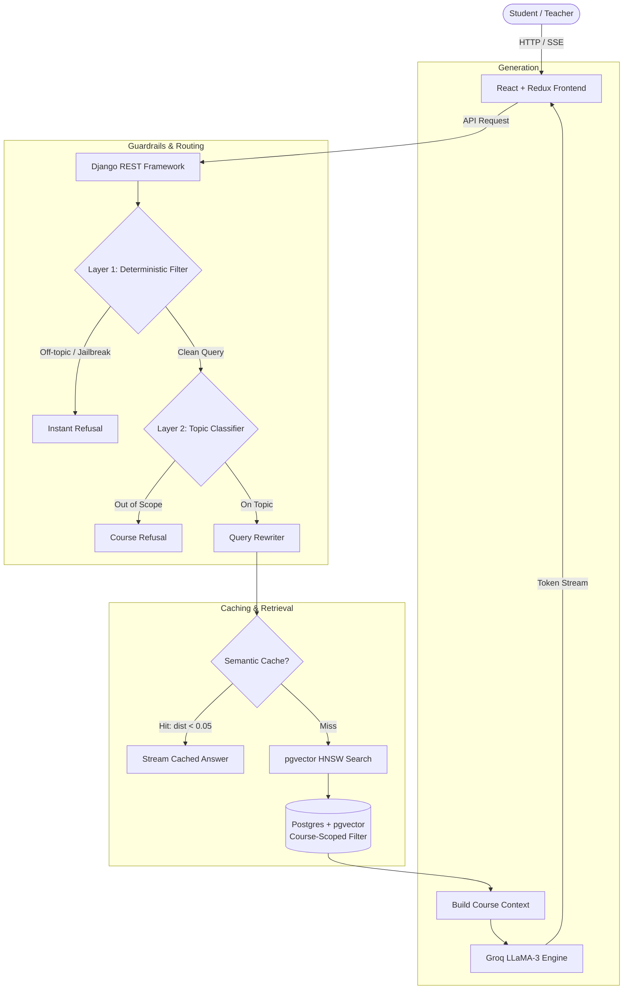

# Scholaria 🎓


Scholaria is a modern, full-stack Learning Management System (LMS) built with a Robust and multi-tenant **Retrieval-Augmented Generation (RAG)** pipeline. It features an AI learning companion, **Edah**, that delivers context-aware, course-scoped tutoring based on the materials students are actively enrolled in.

---

## Architecture Overview



---

## Core Features

### Role-Based Access Control (RBAC)
- **Teachers**: Manage courses, modules, lessons, quizzes, and assignments. AI interactions are restricted to their taught curriculum.
- **Students**: Enroll in courses, complete lessons, submit assignments, and take quizzes. AI tutoring is scoped strictly to their enrolled courses.
- **Admins**: Platform oversight and system administration.

### AI Learning Companion (RAG Pipeline)
- **Automated Ingestion**: Django post-save signals automatically trigger text chunking (`RecursiveCharacterTextSplitter`) and vector embedding (`sentence-transformers/all-MiniLM-L6-v2`) upon lesson, quiz, or assignment creation.
- **PostgreSQL Vector Retrieval**: Uses PostgreSQL with `pgvector` and HNSW indexing for scalable, low-latency cosine distance vector similarity search.
- **Database-Level Multi-Tenancy**: Vector retrieval strictly filters candidate chunks by the student's enrolled `course_id`s at the database level, preventing cross-course data leakage.
- **Dual-Mode Response Generation**:
  - *Grounded Mode*: Prioritizes retrieved course materials and cites specific lessons.
  - *Controlled Fallback*: When course materials do not fully cover a concept, explicitly disclaims that the topic is outside the syllabus and supplements with general academic knowledge within the enrolled course scope.
- **Multi-Layer Guardrails & Performance**:
  - *Layer 1 (Regex)*: Sub-millisecond deterministic keyword pre-filter to reject off-topic queries and prompt injections instantly without API costs.
  - *Layer 2 (LLM Classifier)*: Course-scoped binary classification that fails open during transient API degradations to maintain platform availability.
  - *Semantic Caching*: Caches query embeddings in `pgvector` (cosine distance threshold < 0.05) to eliminate LLM latency and token costs on repeated questions.

---

## Tech Stack

* **Backend**: Django 4.2, Django REST Framework, Gunicorn, Celery, Redis
* **Vector Database**: PostgreSQL 16 + `pgvector` (HNSW indexing)
* **Embedding Model**: `sentence-transformers` (`all-MiniLM-L6-v2`, 384 dimensions)
* **LLM Engine**: Groq API (LLaMA 3) with Server-Sent Events (SSE) streaming
* **Frontend**: React 18, Vite, Redux Toolkit, React Router v6
* **Package Management & Tooling**: `uv`, Docker, Docker Compose

---

## Local Setup & Installation

### Prerequisites
- [Docker](https://docs.docker.com/get-docker/) & Docker Compose
- A [Groq API Key](https://console.groq.com/) for AI inference

### 1. Clone the repository
```bash
git clone https://github.com/mpyth0nist/scholaria.git
cd scholaria
```

### 2. Configure Environment Variables
Copy the example environment file and add your Groq API key:
```bash
cp .env.example .env
```
*(The default database credentials in `.env.example` work out of the box with Docker Compose. Add your `GROQ_API_KEY` in `.env`).*

### 3. Run with Docker Compose
```bash
docker compose up --build
```

The application will be available at:
* **Frontend**: `http://localhost:80`
* **Backend API**: `http://localhost:8000/api/`

### 4. Database Setup (Initial Run)
In a separate terminal, apply migrations and create an administrator:
```bash
docker compose exec backend uv run manage.py migrate
docker compose exec backend uv run manage.py createsuperuser
```

---

## 🧪 Testing

The test suite covers the RAG utility layer, document ingestion idempotency, LLM mocking, and role-based API scoping.

Run the test suite inside the backend container:
```bash
docker compose exec backend uv run pytest
```

Or locally with a running PostgreSQL container:
```bash
docker compose up -d postgres
uv run pytest
```
